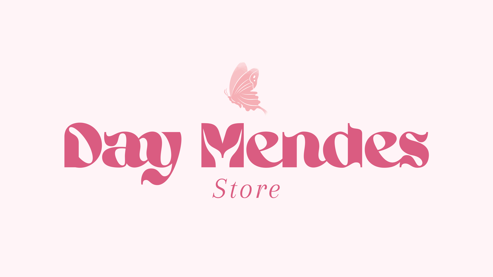

<div align="center">

  

  <p><strong>Sistema de gestão comercial, controle de estoque por variações e emissão de relatórios executivos para moda feminina.</strong></p>

  <p>
    <a href="https://dotnet.microsoft.com/"></a>
    <a href="https://learn.microsoft.com/dotnet/csharp/"></a>
    <a href="https://learn.microsoft.com/aspnet/core/"></a>
    <a href="https://vuejs.org/"></a>
    <a href="https://www.typescriptlang.org/"></a>
    <a href="https://www.mysql.com/"></a>
    <a href="https://learn.microsoft.com/ef/core/"></a>
    <a href="https://www.questpdf.com/"></a>
  </p>

</div>

---

## 🛍️ Sobre o projeto

O **Day Mendes Store** é um sistema de gestão desenvolvido sob medida para o varejo de moda feminina. O projeto centraliza o controle de catálogo, o registro de clientes, a frente de caixa (vendas) e a geração de relatórios estratégicos para tomada de decisão.

O diferencial do sistema está em seu modelo de estoque por variações físicas (**tamanho** e **cor**), garantindo integridade transacional em todas as operações de venda, cancelamento com estorno e reposição de mercadorias.

---

## ✨ Funcionalidades

- **🛍️ Gestão de Produtos & Categorias**: Cadastro, edição, inativação lógica (*soft delete*) e consulta com paginação e filtros.
- **🎨 Variações por Tamanho e Cor**: Controle de múltiplos tamanhos e cores por produto, com saldo de estoque individualizado por variação.
- **📦 Controle & Movimentação de Estoque**: Entradas manuais, ajustes de inventário e histórico completo de movimentações.
- **👥 Gestão de Clientes**: Cadastro, edição, inativação e vínculo com o histórico de vendas.
- **💰 Frente de Caixa & Vendas (PDV)**: Criação de pedidos em rascunho, edição de itens e finalização com validação e baixa atômica de estoque.
- **↩️ Cancelamento & Estorno**: Cancelamento de pedidos com devolução automática do estoque para a variação correspondente.
- **📊 Relatórios Gerenciais**: Dashboard com indicadores gerais, ranking de produtos mais e menos vendidos, giro por tamanho, alertas de estoque baixo e sugestão inteligente de reposição.
- **📄 Relatório Executivo em PDF**: Emissão de relatórios executivos formatados e diagramados via **QuestPDF**, personalizados com a identidade visual da loja.
- **🔐 Autenticação & Segurança**: Controle de acesso com tokens **JWT**, senhas criptografadas com **BCrypt** e rotinas para configuração inicial da loja.

---

## 👗 Modelagem de Produto

No varejo de moda, o item comercializado é definido pela combinação do modelo com tamanho e cor. O sistema reflete essa regra de negócio de forma simples e direta:

* **Produto**: Representa o modelo no catálogo (nome, marca, categoria, preço de compra, preço de venda e estoque mínimo).
* **Variação do Produto (`VariacaoProduto`)**: Representa a unidade física com tamanho e cor específicos, onde reside o saldo de estoque real.

```text
Vestido Midi Floral
├── P / Rosa   → 3 unidades
├── M / Rosa   → 5 unidades
├── M / Azul   → 4 unidades
└── G / Azul   → 2 unidades
```

> [!NOTE]
> O **estoque total** do produto é calculado dinamicamente em tempo real pela soma das quantidades de todas as suas variações ativas.

---

## 🛠️ Tecnologias

### Backend
- **C# / .NET 10** (ASP.NET Core Web API)
- **Entity Framework Core 9** com **Pomelo MySQL Provider**
- **MySQL 8.0**
- **Autenticação JWT** (JSON Web Tokens com Bearer Scheme)
- **QuestPDF** (Geração de relatórios executivos em PDF)
- **BCrypt.Net** (Hashing seguro de senhas)
- **Swagger / OpenAPI** (Documentação interativa da API)

### Frontend
- **Vue 3** (Composition API & `<script setup>`)
- **TypeScript**
- **Vite 8** (Build tool e ambiente de desenvolvimento)
- **Pinia** (Gerenciamento de estado global)
- **Vue Router** (Roteamento SPA)

---

## 📁 Estrutura do projeto

```text
day-mendes-store/
├── backend/
│   ├── DayMendesStore.API/            # Controllers REST, Middlewares, Auth e Swagger
│   ├── DayMendesStore.Application/    # DTOs, Interfaces de Serviço e Casos de Uso
│   ├── DayMendesStore.Domain/         # Entidades, Enums e Regras de Negócio Puras
│   └── DayMendesStore.Infrastructure/ # DbContext, Mapeamentos EF Core e Repositórios
│
├── frontend/                          # Aplicação SPA (Vue 3, TypeScript, Vite e Pinia)
└── logo/                              # Identidade visual oficial da marca
```

---

## 🚀 Como executar

### Pré-requisitos
- [.NET 10 SDK](https://dotnet.microsoft.com/download/dotnet/10.0)
- [Node.js](https://nodejs.org/) (v22 ou superior)
- [MySQL Server 8.0+](https://dev.mysql.com/downloads/mysql/)

---

### 1. Backend

1. Acesse a pasta do backend:
   ```bash
   cd backend
   ```

2. Configure a string de conexão do MySQL no arquivo `DayMendesStore.API/appsettings.json`:
   ```json
   "ConnectionStrings": {
     "DefaultConnection": "Server=localhost;Port=3306;Database=day_mendes_store;User=root;Password=SUA_SENHA_AQUI;"
   }
   ```

3. Aplique as migrações no banco de dados:
   ```bash
   dotnet ef database update --project DayMendesStore.Infrastructure --startup-project DayMendesStore.API
   ```

4. Execute a API:
   ```bash
   dotnet run --project DayMendesStore.API
   ```

A API estará em execução em `http://localhost:5114`.

---

### 2. Frontend

1. Em um novo terminal, acesse a pasta do frontend:
   ```bash
   cd frontend
   ```

2. Instale as dependências:
   ```bash
   npm install
   ```

3. Inicie a aplicação:
   ```bash
   npm run dev
   ```

A aplicação estará acessível em `http://localhost:5173`.

---

## 📊 Relatórios

A API disponibiliza endpoints para acompanhamento operacional e financeiro da loja:

- **Dashboard Geral**: Indicadores de faturamento, total de vendas e ticket médio por período.
- **Produtos Mais e Menos Vendidos**: Ranking por quantidade de itens e volume financeiro.
- **Análise por Tamanho**: Desempenho de vendas agrupado por numeração.
- **Estoque Baixo & Sugestão de Reposição**: Alertas de produtos abaixo do estoque mínimo e cálculo para compra.
- **Produtos Parados**: Itens sem movimentação no intervalo consultado.
- **Melhores Clientes**: Identificação dos clientes com maior frequência de compra.
- **Relatório Executivo em PDF**: Relatório diagramado e pronto para download via **QuestPDF**.

---

## 📚 API

A API conta com documentação interativa gerada pelo **Swagger / OpenAPI**, permitindo testar requisições e realizar autenticação Bearer JWT diretamente pela interface web:

* **URL do Swagger UI**: [http://localhost:5114/swagger](http://localhost:5114/swagger)

---

## 💡 Principais decisões

- **Estoque por Variação**: O controle de saldo reside exclusivamente na combinação de tamanho e cor, atendendo à realidade do varejo de moda.
- **Preço Centralizado no Produto**: Valores de compra e venda são unificados no cadastro do modelo, simplificando a precificação.
- **Transações Atômicas**: Operações de venda e estorno são executadas com garantia transacional, prevenindo inconsistências no estoque.
- **Preservação de Histórico**: Registros vinculados a vendas utilizam exclusão lógica (*soft delete*), mantendo a integridade histórica e contábil.

---

<div align="center">
  <p><strong>Day Mendes Store</strong> &bull; Sistema de Gestão Comercial &bull; 2026</p>
</div>
